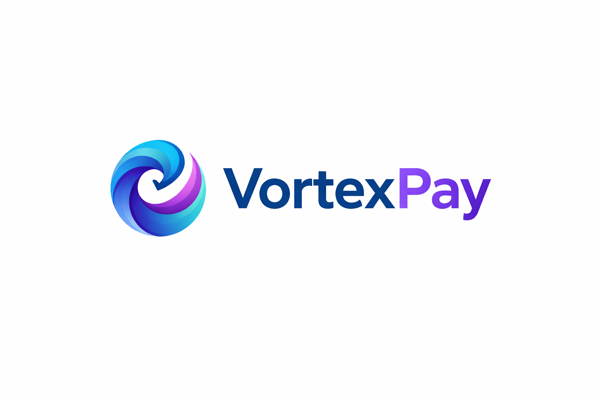

<div align="center">


</div>

# 🌀 VortexPay API

**VortexPay** is a robust digital banking ecosystem API, inspired by modern fintechs like **Banco Inter**. This project serves as the core engine for a digital bank, handling everything from secure user authentication to complex financial transaction settlements.

Unlike simple banking systems, VortexPay utilizes a smart data architecture that decouples access identity (**User**) from personal profiles (**Customer**) and asset management (**Account**), ensuring top-tier security and scalability.

## 🛠️ Tech Stack: The "Why" Behind the Choices

| Technology | Purpose | Why I choose it |
|-|-|-|
| **Spring Boot** | Framework | Provides a robust, production-ready environment with built-in security and auto-configuration. |
| **PostgreSQL** | Primary Database | Relational database known for data integrity and performance in financial transactions. |
| **JWT & Cookies** | Security | Implements stateless authentication with ``HttpOnly`` cookies to prevent XSS and CSRF attacks. |
| **Docker** | Containerization | Ensures the application runs exactly the same way in development, testing, and production. |
| **Hibernate (JPA)** | ORM | Simplifies data mapping between Java objects and the database, reducing boilerplate SQL. |
| **Mockito** | Testing | Allows isolating services to test business logic (like transfers) without hitting the real database. |
| **H2 Database** | Testing DB | Provides a fast, in-memory database for automated tests, ensuring a clean state every run. |
| **Lombok** | Productivity | Reduces boilerplate code (getters, setters, constructors) making the classes much cleaner. |

## ⚙️ Core Features

* **Authentication System:** Secure login/register with password encryption and JWT session management.
* **Identity Decoupling:** Unique architecture separating Authentication (User), Profile (Customer), and Assets (Account).
* **Financial Transactions:** Secure money transfers between accounts with balance validation.
* **Self-Documented API:** Interactive documentation via Swagger UI to test all endpoints in real-time.

## 🗺️ Database Schema

The system architecture is based on a one-to-one and many-to-one relationship model to ensure data normalization:
* **User ↔ Customer**: 1:1 (Security vs. Profile)
* **Customer ↔ Account**: 1:1 (Profile vs. Assets)
* **Account ↔ Transaction**: 1:N (History tracking)

## 🛡️ Business Rules & Error Handling

| Scenario | Logic | Exception | HTTP Status |
|-|-|-|-|
| **Balance** | Withdrawals cannot exceed current balance. | ``InsuficientFunds`` | *422* |
| **Account Status** | No transactions if account is ``BLOCKED`` or ``INACTIVE``. | ``AccountBlocked`` or ``AccountInactive`` | *422* |
| **Duplicity** | Unique Email (User) and unique Document (Customer). | ``AlrealdyExists`` | *409* |
| **Security** | Login fails if password doesn't match BCrypt hash. | ``InvalidPassword`` | *422* |

## 🏗️ Implementation Details

* **Welcome Bonus:** New accounts are automatically initialized with a **$ 10.00** balance using JPA ``@PrePersist`` hooks.
* **Atomic Transactions:** All financial movements are wrapped in ``@Transactional`` blocks, ensuring data consistency (all-or-nothing).
* **Secure Identifiers:** The system uses ``UUID`` for all primary keys and a custom ``SecureRandom`` generator for 8-digit account numbers.
* **State Management:** Clear separation of concerns between ``AccountStatus`` (Active/Blocked) and `TransactionType` (Deposit/Withdrawal/Transfer).

## 📂 Project Structure

The project follows a standard Spring Boot layered architecture, ensuring a clean separation of concerns:

```text
src/main/java/com/pay/vortexpay/

├── configs/          # Security (JWT/Filter) and App Configuration beans
├── controllers/      # REST Endpoints for Auth, User, Customer, Account, and Transactions
├── dtos/             # Request/Response Data Transfer Objects (using Records)
├── entities/         # JPA Entities for Database Mapping (User, Customer, Account, Transaction)
├── exceptions/       # Custom Exception classes and Global Exception Handler
├── mappers/          # Component interfaces for Entity/DTO conversion
├── repositories/     # Spring Data JPA Interfaces for Database communication
├── services/         # Business Logic, Validators, and Security processing
└── shared/           # Enums and Shared Constants (UserRole, AccountStatus, etc.)
```

## 📖 API Documentation

The API is fully documented using **Swagger UI**. You can explore and test all available endpoints (Authentication, Accounts, Transactions, etc.) by running the project and navigating to:

- **Swagger UI:** `http://localhost:8080/swagger-ui/index.html`

## 🚀 Getting Started

### 📄 Prerequisites
- Docker & Docker Compose
- Java 21+ (if running locally)
- Maven 3.8+

### 🐋 How to Run

**1. Clone the repository:**
```bash
git clone https://github.com/nicholas-sc-08/vortexpay-api.git
```

**2. Build the application:**
```bash
./mvnw clean package -DskipTests
```

**3. Spin up the environment (Postgres + API):**
```bash
docker compose up --build
```


## 🧪 Testing Strategy

Quality is ensured through a combination of unit and integration tests:

- **Unit Testing:** Using **JUnit 5** and **Mockito** to isolate business logic in `TransactionService` and `AccountService`.

- **Validation Testing:** Ensuring that constraints like "Insufficient Funds" or "Blocked Account" correctly trigger the custom exceptions.

- **In-Memory DB:** Utilizing **H2 Database** for fast and reliable integration testing during the build process.

---
## 👤 Author

**Nicholas Serencovich Carvalho** *Full Stack Developer & Systems Development Student*

> Aspiring Computer Science student at **MIT**. Currently mastering the Spring Ecosystem.

[](https://www.linkedin.com/in/nicholas-s-carvalho/)
[](mailto:nicholassc.2008@gmail.com)